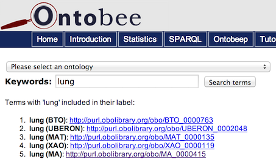
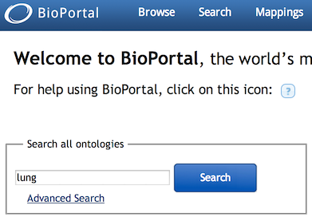
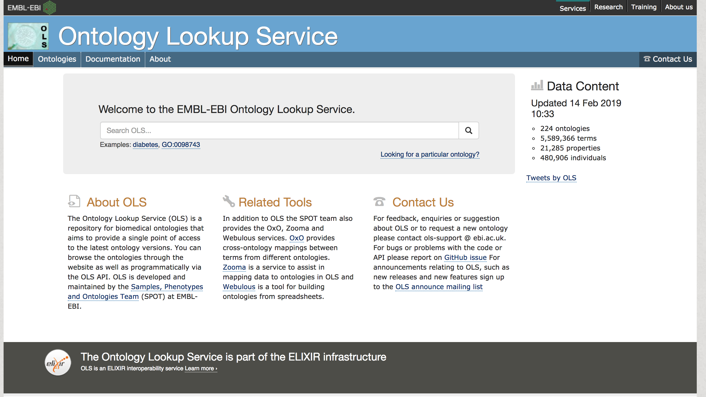
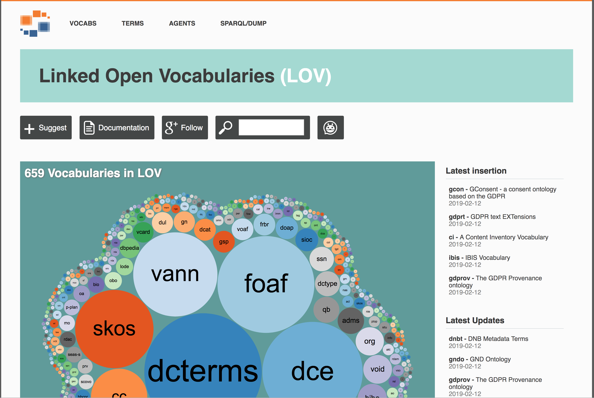
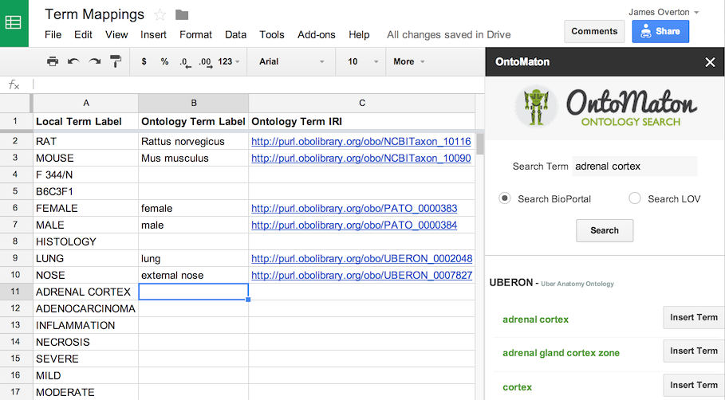
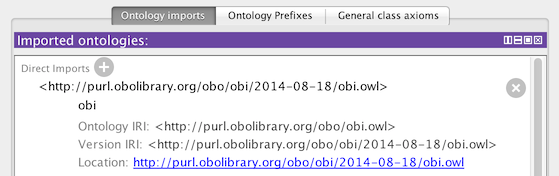

# Using and Reusing Ontology Terms

IRIs give us all the globally unique names that we need. Ontologies give us systems of standardized names (and more). Now let's see how to use them.

"Using" an OBO reference ontology term means using its IRI in your data. Every term should have just one IRI -- don't make up your own name for it, use the official one! In this section you'll learn how to find the terms you want, how to assess whether they're high-quality, and how to import them into the application ontology for your project. We'll illustrate these techniques by building an application ontology to support our running example.

## Finding Ontologies and Ontology Terms

OBO ontologies are freely distributed, and there's a number of different web sites that you can use to find them. We usually begin by searching for an appropriate label, and then check to make sure that the textual and logical definitions fit what we need.

### Ontobee

[Ontobee](http://ontobee.org) lists all the OBO ontologies and provides useful search and analysis tools. Many OBO projects use it as the endpoint for their PURLS -- if you click <http://purl.obolibrary.org/obo/OBI_0000070> you'll be taken to the Ontobee page for OBI's "assay" term. Ontobee also provides information on how each term is used in other OBO ontologies. Ontobee term pages provide RDF/OWL data that can be used by software. I use Ontobee all the time for finding OBO terms, either within an ontology that I know or across all the OBO projects.

### BioPortal

[BioPortal](http://bioportal.bioontology.org) provides access to OBO ontologies and many more ontologies and terminologies for biology and medicine. If you can't find the term you're looking for using Ontobee, maybe you can find it using BioPortal. If the term you want belongs to an ontology that is not part of OBO, you might still be able to use it. See the section below on assessing ontologies for reuse.

### Ontology Lookup Service (OLS)

The [Ontology Lookup Service (OLS)](https://www.ebi.ac.uk/ols/index) is a repository for biomedical ontologies that aims to provide a single point of access to the latest ontology versions. You can browse the ontologies through the website as well as programmatically via the OLS API. OLS is developed and maintained by the Samples, Phenotypes and Ontologies Team (SPOT) at EMBL-EBI.

### Linked Open Vocabularies (LOV)

[Linked Open Vocabularies (LOV)]() is a repository for ontologies on the web.  If you need a concept from an ontology outside the domain of biomedicine, this is a good place to look.  Originally hosted by the Open Knowledge Foundation, it is now maintained by the Ontology Engineering Group (OEG) at the Computer Science School at Universidad Politécnica de Madrid (UPM).

### OntoMaton

[OntoMaton](https://github.com/ISA-tools/OntoMaton#readme) is a useful plugin for [Google Spreadsheets](https://docs.google.com/spreadsheets/). It lets you search BioPortal, OLS, or LOV to find terms and include them in your spreadsheet.  Note that some of the configuration options are broken because Google has deprecated the APIs OntoMaton uses, but the search part works just fine.  The search results also include links to PURLs so you can check definitions before you use terms.  This is a good tool for quickly looking up term mappings.

### Other places to find ontologies

Ontobee lists all the OBO ontologies and a few more, but the official list is at the OBO home page: <http://obofoundry.org>. That list distinguishes between "OBO Foundry" ontologies that have been reviewed for their adherence to the OBO Foundry principles, and "OBO Library" ontologies that have made a commitment to the principles but have not been reviewed. For each entry there's a brief description of the domain, plus links to information pages and ontology files.

Several of the OBO principles and best practices are based on open source software development best practices. These include keeping files in publicly accessible version control systems that track and store every change to the ontology. Most OBO projects use [GitHub](https://github.com) but some still use [SourceForge](http://sourceforge.net).

OBO projects use the [Web Ontology Language (OWL)](http://www.w3.org/TR/owl2-overview/) and are distributed in OWL files. You can use the Ontobee and BioPortal websites to browse ontologies, but if you want to download the OWL file and work with it on your computer then you probably want to use [Protégé](http://protege.stanford.edu). Protégé is free, open source, and cross-platform.

## Assessing Ontologies and Terms for Reuse

Once you find a term that might be suitable, there are some things that you should check before you start using it. The OBO principles are intended to cover all these points, so when using a term from an OBO ontology it should be quick to check all these boxes. With projects outside the OBO community you will have to check more carefully.

### License

The first question is: can I use this term in my application ontology? This raises a series of questions about copyright.

OBO ontologies are intended to be shared and required to be [open](http://obofoundry.github.io/principles/fp-001-open.html), in the sense of "open source". The [Creative Commons CC-by 3.0](https://creativecommons.org/licenses/by/3.0/) license is recommended for OBO projects, although there's some variation. We expect people who use OBO ontology terms to use the official IRI for that term. We also expect users to respect common standards in the scientific community for giving credit to ontology developers for their work, such as citing the ontology in your publications. (Most ontologies have a "release paper" in a journal that you can use for citations. Check the ontology's website.)

### PURLs

Every term should have a single, official IRI that identifies it, often called a "PURL". When you put that IRI into a web browser you should be directed to a useful webpage or file. Even IRIs for obsolete terms should continue to point to something useful. If the term you want to use doesn't have a reliable, permanent identifier, than how can you be sure that you and the rest of the community are using the same term?

There is an OBO principle for [unique identifiers](http://obofoundry.github.io/principles/fp-003-uris.html) and a [identifier policy](http://www.obofoundry.org/id-policy.html) with the technical details.

### Labels

Every term should have a single, official label. It can have many synonyms, translations, and alternative terms, but there should be a just one official label. It should probably be in American English. Ideally, it will be unambiguous across all of biology and biomedicine, and avoid ambiguities with common words in English. It shouldn't contain jargon or acronyms. Taking all of this into account, many ontology labels are long and ugly, but at least they're clear. You can always add a shorter synonym or alternative term.

Labels are important, but the definition is even more important, so don't stop at reading the label!

OBO ontology terms all have an `rdfs:label` value. Some OBO ontologies use the IAO [editor preferred term](http://purl.obolibrary.org/obo/IAO_0000111) annotation to store the unique label, so that the `rdfs:label` can be changed to an alternative term suitable for particular use cases. There are also [naming conventions](http://obofoundry.github.io/principles/fp-012-naming-conventions.html) for OBO terms, and an [IAO ontology metadata](https://github.com/information-artifact-ontology/IAO/wiki/OntologyMetadata) page.

### Textual Definitions

Does the term have a textual definition?

There's a surprising number of "ontologies" out there with terms that have IRIs and labels but no textual definitions at all. There's a simple reason for that: good textual definitions are hard to write! And when you've written a clear and concise textual definition of 'X', more often than not you'll find that your collaborators say "That's not how we use 'X'". It's not until you have a definition that you can really start to discuss the meaning of a term, and build some consensus. Without a good definition it's hard to be sure that everyone understands the term in the same way.

For our current purposes, an "annotation" is a bit of data attached to a term that doesn't have logical structure -- we'll talk about logic in just a second. [Labels](http://www.obofoundry.org/wiki/index.php/FP_012_naming_conventions) and [textual definitions](http://www.obofoundry.org/wiki/index.php/FP_006_textual_definitions) are the most important annotations, but terms are even more valuable when they have examples of usage, synonyms and alternative terms, editor names and editor notes. If a term looks promising, read all of its annotations.

### Logical Definitions

Does the term have a logical definition?

With few exceptions, every term should have a parent term. OBO ontologies usually extend the [Basic Formal Ontology (BFO)](https://github.com/BFO-ontology/BFO) which has just one term without a parent: "[entity](http://purl.obolibrary.org/obo/BFO_0000001)".

Most ontologies use the Web Ontology Language, which provides a range of powerful tools for make logical statements about terms and their relationships. Well-defined logical relations allow for automated reasoning over the ontology and the data that uses it. The richer the logical definitions, the more work the reasoner can do, although there's a balance to strike between power and performance.

If the term you want to use fits into the upper ontology and other relations that you're already using, then you're enriching the network of data in your application ontology. If the term doesn't fit, then you might not be adding much by using it. OBO ontologies strive to form a rich, interconnected network.

### Term Status

Terms have a "life cycle", starting with their creation and ending with their obsolescence. You should check the status of a term before using it.

Terms that should no longer be used are marked as *obsolete* using the OWL [deprecated](http://www.w3.org/2002/07/owl#deprecated) annotation, and a reason may be given using the IAO [has obsolescence reason](http://purl.obolibrary.org/obo/IAO_0000231) annotation. The word "obsolete" is usually added to the label as a further warning. An obsolete term should *not* be used for new data! However it is best practise to maintain obsolete terms indefinitely at the same IRI to support old data. If a term you want to use is marked obsolete, check the annotations for a preferred replacement.

Many OBO terms are annotated with IAO [has curation status](http://purl.obolibrary.org/obo/IAO_0000114) to indicate where the term is in its life cycle. A mature term is marked [ready for release](http://purl.obolibrary.org/obo/IAO_0000122), and other statuses indicate how close the term is to maturity. You should prefer terms with status closer to the top of this list:

- [ready for release](http://purl.obolibrary.org/obo/IAO_0000122)
- [pending final vetting](http://purl.obolibrary.org/obo/IAO_0000125)
- [metadata complete](http://purl.obolibrary.org/obo/IAO_0000120)
- [metadata incomplete](http://purl.obolibrary.org/obo/IAO_0000123)
- [requires discussion](http://purl.obolibrary.org/obo/IAO_0000428)
- [organizational term](http://purl.obolibrary.org/obo/IAO_0000121)
- [to be replaced with external ontology term](http://purl.obolibrary.org/obo/IAO_0000423)
- [example to be eventually removed](http://purl.obolibrary.org/obo/IAO_0000002)
- [uncurated](http://purl.obolibrary.org/obo/IAO_0000124)

Problems that are keeping a term from being "ready for release" are often explained in an editor note.

### Community

Who made this ontology? When was it made? Has it been updated since its initial release? Is it ever going to be updated again?

Several related OBO principles require that an ontology have a community of [users](http://www.obofoundry.org/wiki/index.php/FP_009_users) who [collaborate](http://www.obofoundry.org/wiki/index.php/FP_010_collaboration) on the ontology, [some person or group or organization in charge](http://www.obofoundry.org/wiki/index.php/FP_011_locus_of_authority), and a commitment to ongoing [maintenance](http://www.obofoundry.org/wiki/index.php/FP_016_maintenance). Too often I've found an ontology that passes all the other criteria, but it was developed by a few authors to support a single project five years ago, and it hasn't been updated since. Building an ontology and maintaining it is hard. Building a community and maintaining it is even harder. But this is another thing that OBO projects strive to do.

## Mapping Terms

We've just seen how to find OBO ontologies and terms, and how to assess their quality. Now let's put that into practise.

Starting with data like our [data-before.csv](https://github.com/OHSU-Library/obo-tutorial/blob/master/examples/data-before.csv) spreadsheet, the first step is usually to create a list of all the "local" terms you want to "map" to reference ontology terms. You can put this list in a spreadsheet. Then you can use Ontobee and OntoMaton to find one ontology term for each local term. Usually one can be found with a little work, but sometimes not. The third step is to decide how to get each term into the application ontology. 

So those are the three steps:

1. make a list of local terms
2. search for reference ontology terms
3. decide how to import each term into my application ontology

This [Google spreadsheet](https://docs.google.com/spreadsheets/d/16_CcUQc5bgAiJn2VALGp537uQzavInd5tyqzTbNvQLI/edit?usp=sharing) shows the list of terms from [data-before.csv](https://github.com/OHSU-Library/obo-tutorial/blob/master/examples/data-before.csv), the reference ontology terms to map them to, and the import technique to use. It also shows how you can use the OntoMaton plugin to make searching easier.

A copy of the Google spreadsheet can be found in the [terms.csv](https://github.com/OHSU-Library/obo-tutorial/blob/master/examples/terms.csv) file.  You can use the obo-tutorial.jar program to convert them automatically.

`cd examples

java -jar obo-tutorial.jar map terms.csv data-before.csv data-after.csv`

You can see the result in [data-after.csv](https://github.com/OHSU-Library/obo-tutorial/blob/master/examples/data-after.csv)

## Importing Terms

Once you've found the perfect term, how do you get it into your application ontology? What if you can't find the perfect term? In either case, there's a range of techniques that you can use.

### Importing Single Terms with MIREOT

Using an ontology term means using its IRI, but you will also want to keep its label, definition, and other annotations. [MIREOT: The minimum information to reference an external ontology term](http://iospress.metapress.com/content/h54m2237310v13x1/) is a guideline for what information to include when importing a term. We even use "MIREOT" as a verb: "You should MIREOT that term into your ontology."

When you MIREOT a term, you don't have to include its parent terms or logical axioms, but if you don't then you have to be careful. As an example, the term [Homo sapiens](http://purl.obolibrary.org/obo/NCBITaxon_9606) is about 29 nodes deep in the NCBI Taxonomy. If you want to use that term, you probably don't want to import all its ancestors. But you do have to ensure that everything you say about that term is still true! You could place *Homo sapiens* under [Mammalia](http://purl.obolibrary.org/obo/NCBITaxon_40674) in your application ontology, which would be true, even if it doesn't include all the information that's in the NCBI Taxonomy. Don't place it under the NCBI term [Mus musculus](http://purl.obolibrary.org/obo/NCBITaxon_10090) because then your assertion would be false!

### Importing Sets of Terms Using OBO ROBOT

[ROBOT](http://robot.obolibrary.org/) is a tool for working with Open Biomedical Ontologies. It can be used as a command-line tool or as a library for any language on the Java Virtual Machine.  It has an EXTRACT command that enables extraction of sets of terms from ontologies with a variety of techniques, including MIREOT.  [Refer to the documentation to learn more](http://robot.obolibrary.org/extract).

### Importing Sets of Terms Using OntoFox

[OntoFox](http://ontofox.hegroup.org) is a convenient tool for MIREOTing terms from OBO ontologies. You can use the form on the web site, or you can create an input file that specifies the configuration and upload it. The configuration file is useful when you want to run the same import repeatedly, to get the latest versions of the terms, for instance.

OntoFox is a free service, but it has limited resources. If you aren't careful, you can request too many terms. If this happens then the server can hang or crash, and not only won't you get the result you wanted but other people won't be able to use the service. I recommend using OntoFox only for small sets of terms, say less than a hundred, including intermediate terms discussed below.

To use OntoFox you need to select a source ontology, then provide two sets of terms that you want to import: low level terms and top level terms. You will also have to choose whether you want to include *intermediate* terms. You have three options:

- `includeNoIntermediates`: only the terms you specified will be included
- `includeAllIntermediates`: all the terms between low level and top level will be included
- `includeComputedIntermediates`: a minimal set of terms connecting the low level to the top level will be included

Another option is to include all the children of a given low level term. These options can be a little confusing at first, and it's worthwhile to experiment with a few different combinations. For large ontologies such as the NCBI Taxonomy, `includeNoIntermediates` is probably the best choice. Otherwise `includeComputedIntermediates` strikes a good balance.

Beware that including too many intermediate terms can cause problems for the OntoFox server. When you're experimenting with including intermediates, make sure that there's only a few levels of hierarchy between "low" and "top", and start with just a few of the terms you want to import.

OntoFox also provide a range of options for selecting which annotations you want to include, and for mapping between sets of annotations. Although the form on the web site only allows extracting terms from one ontology at a time, in a configuration file you can specify several ontologies each with a number of terms and other settings. This is another reason to learn how to use the [input configuration files](http://ontofox.hegroup.org/tutorial/index.php#input_format).

The [ontofox.txt](https://github.com/OHSU-Library/obo-tutorial/blob/master/examples/ontofox.txt) file shows what an OntoFox input file looks like. It has four sections because we're importing from four ontologies: OBI, NCBI Taxonomy, MPATH, and PATO. It lists the low level and top level terms we want to import from each reference ontology. Each section has a different rule for selecting intermediates, but all of them use either  `includeAllAxiomsRecursively` or `includeAllAnnotationProperties` to get the full set of annotations. It also shows how to use `subClassOf` to place imported terms exactly where you want them.

On the OntoFox website you can "Upload input file" and with `ontofox.txt` then click "Get OWL (RDF/XML) Output File". The resulting OWL file is [ontofox.owl](https://github.com/OHSU-Library/obo-tutorial/raw/master/examples/ontofox.owl).

### Importing Lists of Terms with Quick Term Templates

The MIREOT technique and OntoFox tool are the right choice for importing a limited number terms from other ontologies. For creating your own terms, Protégé is a good tool. But if you find yourself creating more than a few terms with very similar structure, you might wish that you had a spreadsheet. In that case, consider using the [Quick Term Template (QTT)](https://content.iospress.com/articles/applied-ontology/ao086) method.

QTT is a technique for transforming tables of data about terms into OWL format. In the table you have a row for each term with columns for the IRI, the label, the definition, and other annotations. You can also have columns with IRIs for other terms that have a well-defined relationship to the term in that row, such as the parent term. This is the input to the QTT tool, and the output is an OWL representation of the same data ready to be used in your ontology.

The [qtt.txt](https://github.com/OHSU-Library/obo-tutorial/blob/master/examples/qtt.txt) file is a tab-separated spreadsheet with the two local terms we want to define for our example: strains of inbred rats and mice. These terms should probably be defined in some OBO ontology but I haven't managed to find them. It suits our current purposes to use them as an example of application ontology terms. As you can see, I've given the term ID in the first column, then annotations such as the label, definition, and editor. I've also given the IRI of the parent term.

Older versions of Protégé supported the [MappingMaster](http://protege.cim3.net/cgi-bin/wiki.pl?MappingMaster) plugin for QTT, but it is no longer maintained. If you know how to write Java code and use OWLAPI then it's straightfoward to write your own QTT code. But the easiest solution is to use Ontorat.

### Importing Lists of Terms Using Ontorat

[Ontorat](http://ontorat.hegroup.org) is another tool in the same family as Ontobee and OntoFox. As with OntoFox, you can use the form on the web site or upload a configuration file. And as with OntoFox, the configuration file has the advantage of being repeatable and providing more powerful options, at the cost of a slightly steeper learning curve.

The [ontorat.txt](https://github.com/OHSU-Library/obo-tutorial/blob/master/examples/ontorat.txt) file shows what an Ontorat input file looks like. We're only using sections for annotations and superclasses, but there are other options. Read the [tutorial](http://ontorat.hegroup.org/tutorial/index.php) to get all the details, but the basic operation is to create a new class for each row in the QTT table, then create annotations and axioms by replacing every occurrence of `{$columnX}` with the contents of column X.

- single quotes are human-readable names for terms, and they should be defined with an IRI for that term
- double quotes are for annotation strings
- angle brackets are for IRIs

On the Ontorat website you can "Load Settings File" with this file to fill in the settings, then "Specify input data file" with a "File upload", and use `qtt.txt`. Then click "Get OWL (RDF/XML) Output File". The resulting OWL file is [ontorat.owl](https://github.com/OHSU-Library/obo-tutorial/raw/master/examples/ontorat.owl). I changed the "Ontology IRI" for this file using Protégé to something more sensible than the default.

### Extracting Ontology Modules with ROBOT

Sometimes you want to import too many terms for OntoFox, but the target ontology is too large to import all of it.  Thre's a tool you can use in this case: OBO [ROBOT](http://robot.obolibrary.org/).  ROBOT is like a Swiss Army Knife for ontology manipulation.  It can do many things, including the steps we just did with OntoFox and Ontorat. Here we are going to use it to filter a source ontology down to a smaller subset and then we will extract the terms we want into a module.

Download [Uberon](http://purl.obolibrary.org/obo/uberon/ext.owl) to the examples directory.

Filter Uberon to part_of and has_part

`robot filter --input ext.owl --term BFO:0000050 --term BFO:0000051 --output uberon-subset.owl`

Extract Uberon terms

`obot extract --method STAR --input uberon-subset.owl --term-file uberon-terms.txt --output uberon-mod.owl`

The result is the uberon-module.owl file, with all the terms listed in uberon-terms.txt and all their part_of/has_part dependencies. 

#### Alternative method: use obo-tutorial.jar

`java -jar obo-tutorial.jar extract \

ext.owl \

uberon-terms.txt \

uberon-module.owl \

"https://github.com/OHSU-Library/obo-tutorial/raw/master/examples/uberon-module.owl"
`

### Importing Ontologies with Protégé

OBO ontologies are part of the web of linked data. Using terms from other ontologies means making links to resources across the web. Another form of linking is *import*: you can import another complete ontology or OWL file into your own ontology.

For our current purposes, there are two main uses for OWL imports. The first is when MIREOT just isn't enough: you don't want to import just a selection of terms from another ontology, you want to import the whole thing. The second is using the results of OntoFox and Ontorat. These tools generate OWL files. Using a configuration file, you can run these tools again and again to update terms, generating new OWL files each time. You should keep those results in separate OWL files, then import those files into your application ontology. This clean separation makes it easy to update your MIREOT imports.

Keep in mind that imports can be somewhat unpredictable. Tools such as Protégé will keep a local copy of imported files, which might not always be up-to-date. If you and your collaborators have different local copies of the imports, you won't see exactly the same terms and axioms, which can lead to all sorts of confusion!

OBO ontologies have versions, usually specified by date. I recommend importing a specific, dated version of any ontology. To update it, just change the import link to the latest dated version. This allows you to control when updates are made. And if the other ontology project releases a new version that breaks something in your ontology, you'll be able to stick to the older version until the problem is fixed.

For OntoFox or Ontorat OWL files, just use the latest OWL files. You control when you update those files, so there shouldn't be any problem with mismatching versions.

Another thing to beware of is the `catalog.xml` (aka `catalog-v001.xml`) files used by Protégé and OWLAPI. These are configuration files that Protégé automatically generates, and that contain information about imports. By editing these files you can change what files Protégé uses for imports, performing all sorts of redirections and substitutions. This can be very convenient and *very* confusing. While sometimes necessary, be very cautious when using `catalog.xml` files. This page explains the [details of OWL imports in Protégé](http://protegewiki.stanford.edu/wiki/How_Owl_2.0_Imports_Work).

To import an ontology, first open your application ontology with Protégé. On the "Active Ontology" tab there should be a pane called "Ontology imports". Look for "Direct Imports" and click the plus sign next to it. This opens the "Import ontology wizard" which will give you a range of choices. You can either import from a local file or from a URI on the web. For reference ontologies I suggest using a URI for a dated version. Protégé will periodically fetch a new copy of the file, so remember to use dated version whenever possible. For OntoFox and Ontorat results I tell the import wizard to use a local file.

Here's a screenshot from the latest Protégé 5 beta release importing the 2014-08-18 version of OBI.

### Editing Ontologies by Hand

Some people prefer the precision and control of editing their ontologies by hand using the [Turtle RDF](https://www.w3.org/TR/turtle/) syntax in a basic text editor.  Protege and ROBOT can export ontologies in Turtle format and there are several RDF format converters available on the web as well.

## Putting it all Together

First we saw how to find reference ontology terms and assess them. Then we saw how to create a "mapping" table for all our terms. And we just saw four techniques for importing reference ontology terms into our application ontology. The last step is to put all of this together and complete our application ontology.

1. Open a new ontology
2. Change its "Ontology IRI" to <https://github.com/OHSU-Library/obo-tutorial/raw/master/examples/application.owl>
3. Import three OWL files:
    - ontofox.owl
    - ontorat.owl
    - uberon-mod.owl
4. Make adjustments: add terms, add annotations, *carefully* adjust the hierarchy
    - Make GO_0008150 a subclass of BFO_0000007
    - Make MPATH_596 a subclass of GO_0008150
    - Make MPATH_603 a subclass of UBERON_0000465
    - Make UBERON_0000104 a subclass of GO_0008150
    - Make UBERON_0000105 a subclass of GO_0008150
    - Make UBEROB_0000464 a subclass of BFO_0000004
    - Make UBERON_0000465 a subclass of BFO_0000040
5. Save the ontology to `application.owl`

Or skip those steps and just look at the resulting [application.owl](https://github.com/OHSU-Library/obo-tutorial/raw/master/examples/application.owl) file that I've created. The result includes all the terms listed in our `terms.csv` file, plus the dependencies that we want. I've also made adjustements to fit everything under BFO "entity" by adding `subClassOf` assertions here and there.

One application ontology can support many similar projects. In the [next section](processing-data.md) we'll see how to connect the data in the running example to the application ontology to take full advantage of it.
